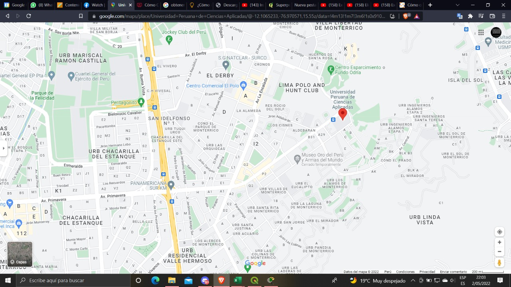

# Universidad Peruana de Ciencias Aplicadas

### COMPLEJIDAD ALGORÍTMICA - CC184

Carrera de Ingeniería de Software

### Sección: 
CC41

### Integrantes:
* Alonso Olbarte Chirinos Paredes U201924282

### Docente
Luis Martin Canaval Sanchez

## Resumen Ejecutivo
El trabajo busca realizar una representación digital de una ciudad teniendo en cuenta sus calles e intersecciones. Para realizarlo se usó como datos de entrada, las intersecciones, donde se juntan más de dos calles, con sus respectivas calles que la conforman, y de estos datos devolvemos un grafo que será el producto final de este primer hito.

Para el desarrollo del trabajo, tuvimos que conseguir los datos requeridos para simular el área que elegimos representar. Con esto, empezamos a trabajar los algoritmos y pasos para el registro de los datos y posteriormente la obtención del grafo ya sea mediante una matriz de adyacencia o una lista de adyacencia.

## Área referencial del trabajo
El trabajo se realizó tomando como referencia en distrito de Surco, para se más exacto las inmediaciones de la Universidad Peruana de Ciencias Aplicadas (UPC) del campus Monterrico

<p align="center">
  
  <p align="center">Figura 1. Imagen de google maps de las cercanías al campus Monterrico.</p>  
</p>

## Descripción de datos consginados por calle
Para el presenta trabajo se a consignado como datos un id de tipo int, un name de tipo string, name_2 también de tipo string, un Coordenada_x de tipo float y un Coordenada_y tambien de tipo float. Siendo name y name_2 representación de las calles que formaron esa intersección, y Coordenada_x y Coordenada_y la representación de las coordenadas de cada intersección.

<p align="center">
  
  <p align="center">Figura 2. Imagen de los datos en excel.</p>  
</p>

## Explicación de como se elaboro el grafo
Para la elaboracion del grafo, primero se realizo una lectura de los datos aprovechando las comas para poder identificar y separar mejor los datos. Luego estos se comenzaron a leer de manera ordenada buscando crear una relacion con otra intersección que tenga una de sus calles en común.
```python
    def createAdjList(self):
        cont = 0
        flag0 = True
        flag1 = True
        for i in range(len(self.nodos)):
            self.adjList.append([])
        for i in range(len(self.nodos) - 1):
            for j in range(i , len(self.nodos) - 1):
                if flag0 and self.nodos[i][0] == (self.nodos[j + 1][0] or self.nodos[j + 1][1]):
                    d = self.t.distance(self.nodos[i][2], self.nodos[i][3],self.nodos[j + 1][2], self.nodos[j + 1][3])
                    self.adjList[i].append([j + 1,d])
                    self.adjList[j + 1].append([i, d])
                    flag0 = False
                if flag1 and self.nodos[i][1] == (self.nodos[j + 1][1] or self.nodos[j + 1][0]):
                    d = self.t.distance(self.nodos[i][2], self.nodos[i][3],self.nodos[j + 1][2], self.nodos[j + 1][3])
                    self.adjList[i].append([j + 1,d])
                    self.adjList[j + 1].append([i, d])
                    flag1 = False
            flag0 = True
            flag1 = True
```
## Explicación de como se halló el camino más corto y los caminos alternativos
Para encontrar el camino más corto y los caminos alternativos entre dos intersecciones se implemento un algoritmo de caminos minimos, en este caso fue el algoritmo de Dijkstra. 
Este algoritmo calcula el camino minimo entre un nodo inicial elegido hacia el resto de nodos del grafo. 
```python
    def dijkstra(self, G, s, e):
        n = len(G)
        visited = [False]*n
        path = [-1]*n
        cost = [math.inf]*n
        cost[s] = 0
        pqueue = [(0, s)]
        while pqueue:
            g, u = hq.heappop(pqueue)
            if not visited[u]:
                visited[u] = True
                for v, w in G[u]:
                    if not visited[v]:
                        f = g + w
                        if f < cost[v]:
                            cost[v] = f
                            path[v] = u
                            hq.heappush(pqueue, (f, v))
        return path, cost
```

Para lograr los camino alternativos se tomo como guía la forma en que google maps nos muestra los camino minimos alternos. Los cuales no toman necesariamente un nuevo camino, sino que pueden tomar una pequeña sección del camino inical para formar parte de un camino alternativo.

<p align="center">
  
  <p align="center">Figura 3. Imagen de Google maps que muestra un ejemplo de caminos alternos.</p>  
</p>

Por ello para el algoritmo se tomo la misma idea y se decidio por eliminar las uniones intermedias, especificamente para este caso solo se borran el 20% de los nodos de anterior path de caminos originado por dijkstra.
```python
    def alternativeRoute(self,copyL, path, start, end, auxPath):
        nPath = []
        copyPath = path
        limit = int(len(copyPath)*0.3)
        for i in range(len(copyPath) - 1):
            s = copyPath[i]
            e = copyPath[i + 1]
            if i > limit and i < len(copyPath) - limit:
                self.t.remove(copyL, s, e) 
                self.t.remove(copyL, e, s)
        OnewPath, newCost = self.t.dijkstra(copyL, start, end)
        return OnewPath, self.t.obtenerPath(end, OnewPath, auxPath)
```
## Conclusiones
- En este trabajo final se lograron concluir satisfactoriamente algoritmos de lectura de datos, creación de grafos usando listas de adyacencia y de busqueda del camino minimo y sus caminos alternos.

Julio 2022
